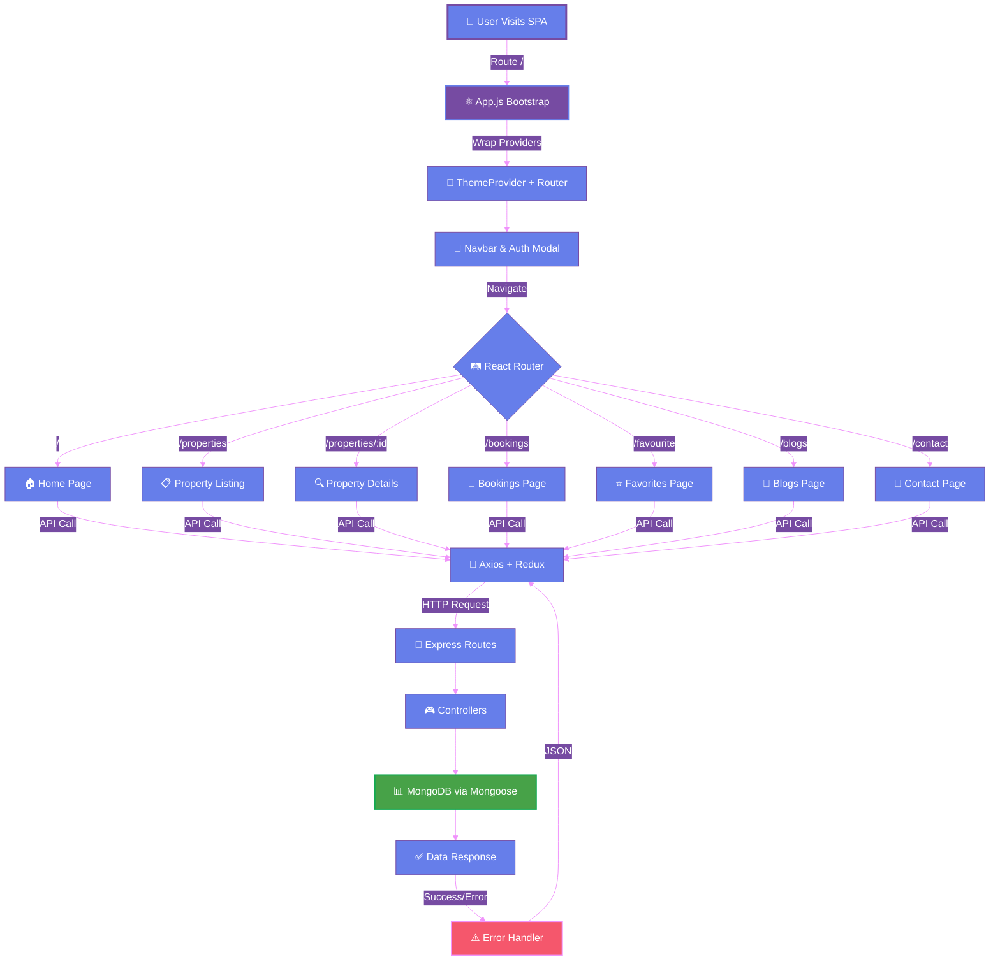
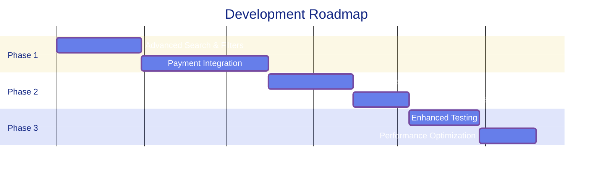

<div align="center">

<!-- Animated Header -->


<!-- Typing Animation -->
<a href="https://git.io/typing-svg"></a>

<!-- Animated Badges -->
<p align="center">
  
  
  
  
  
</p>

<!-- Animated Stats -->
<p align="center">
  
  
  
  
</p>

<!-- Animated Divider -->


### 🌟 A full-stack MERN application inspired by Airbnb
*Explore properties • Manage bookings • Create experiences*

<p align="center">
  <a href="#-key-features">Features</a> •
  <a href="#-getting-started">Getting Started</a> •
  <a href="#-tech-stack">Tech Stack</a> •
  <a href="#-roadmap">Roadmap</a> •
  <a href="#-contributing">Contributing</a>
</p>

</div>

---

## ✨ Key Features

<div align="center">

<!-- Feature Cards with SVG Icons -->
<table>
<tr>
<td align="center" width="25%">

<h3>User Experience</h3>
<p align="left">
• 🏠 Home with hero section<br>
• 📋 Property listings<br>
• 🔍 Detailed property views<br>
• 📅 Booking management<br>
• ⭐ Favorites system<br>
• 📝 Blog & articles<br>
• 📧 Contact integration
</p>
</td>
<td align="center" width="25%">

<h3>Authentication</h3>
<p align="left">
• 🔐 Secure login/register<br>
• 🎫 JWT authentication<br>
• 🗃️ Redux state management<br>
• 💾 Redux Persist<br>
• 👤 Session management<br>
• 🔒 Protected routes<br>
• 🛡️ Password encryption
</p>
</td>
<td align="center" width="25%">

<h3>UI/UX Design</h3>
<p align="left">
• ⚛️ React 18 SPA<br>
• 🎨 Material UI components<br>
• 💅 Styled-Components<br>
• 🌈 Custom theming<br>
• 📱 Fully responsive<br>
• 🎯 Premium animations<br>
• ✨ Custom scrollbars
</p>
</td>
<td align="center" width="25%">

<h3>Backend API</h3>
<p align="left">
• 🚀 Node.js + Express<br>
• 🍃 MongoDB + Mongoose<br>
• 📂 Modular architecture<br>
• ⚠️ Error handling<br>
• 🔓 CORS configured<br>
• ⚙️ Environment config<br>
• 🧪 Test utilities
</p>
</td>
</tr>
</table>

</div>

<!-- Animated Divider -->


## 🏗️ Project Structure

<div align="center">

```
🏡 Air-Bnb-clone/
│
├── 📱 client/                    # React Frontend
│   ├── 🌐 public/
│   │   └── 📄 index.html         # HTML template
│   └── ⚛️ src/
│       ├── 📄 App.js             # Main application
│       ├── 📄 index.js           # Entry point
│       ├── 🔌 api/               # API helpers
│       ├── 🧩 components/        # UI components
│       ├── 📑 pages/             # Page components
│       ├── 🗃️ redux/             # State management
│       └── 🛠️ utils/             # Utilities
│
└── 🖥️ server/                    # Express Backend
    ├── 📄 index.js               # Server bootstrap
    ├── 🎮 controllers/           # Business logic
    ├── 🛤️ routes/                # API routes
    ├── 📊 models/                # Data models
    ├── 🔧 middlewares/           # Middleware
    └── 🧪 scripts/               # Test utilities
```

</div>

<!-- Animated Divider -->


## 🧰 Tech Stack

<div align="center">

### 💻 Frontend Technologies

<p>
  
</p>

| Technology | Purpose | Version |
|------------|---------|---------|
|  | UI Library | 18.0 |
|  | State Management | Toolkit |
|  | Component Library | Latest |
|  | CSS-in-JS | Latest |
|  | Routing | v6 |
|  | HTTP Client | Latest |

### ⚙️ Backend Technologies

<p>
  
</p>

| Technology | Purpose | Version |
|------------|---------|---------|
|  | Runtime | Latest |
|  | Framework | Latest |
|  | Database | Latest |
|  | ODM | Latest |
|  | Authentication | Latest |
|  | Password Hash | Latest |

</div>

<!-- Animated Divider -->


## 🚀 Getting Started

<div align="center">

<!-- Installation Steps with Animated Numbers -->
<table>
<tr>
<td width="50%">

### 1️⃣ Clone Repository
```bash
git clone <your-repo-url>
cd Air-Bnb-clone
```

### 2️⃣ Install Client
```bash
cd client
npm install
```

</td>
<td width="50%">

### 3️⃣ Install Server
```bash
cd server
npm install
```

### 4️⃣ Configure Environment
```env
MONGODB_URL=<connection-string>
JWT_SECRET=<your-secret>
PORT=8080
```

</td>
</tr>
</table>

</div>

### 🎯 Run Development Servers

<div align="center">

| Server | Command | Port |
|--------|---------|------|
| 🎨 **Frontend** | `cd client && npm start` | [localhost:3000](http://localhost:3000) |
| ⚙️ **Backend** | `cd server && npm start` | [localhost:8080](http://localhost:8080) |

</div>

<!-- Animated Divider -->


## 🔍 Core Application Flow

<div align="center">



</div>

<!-- Animated Divider -->


## 🧩 Notable Components & Pages

<div align="center">

| 🎯 Component | 🛤️ Route | 📝 Description |
|-------------|---------|---------------|
|  | `All Pages` | Navigation & authentication control |
|  | `/` | Landing page with hero & featured properties |
|  | `/properties` | Browse all available properties |
|  | `/properties/:id` | Detailed property information |
|  | `/bookings` | Manage user bookings |
|  | `/favourite` | Saved properties list |
|  | `/blogs` | Travel tips & articles |
|  | `/contact` | Contact form with backend |

</div>

<!-- Animated Divider -->


## 🛡️ Security & Best Practices

<div align="center">

<table>
<tr>
<td align="center" width="33%">

<h3>🔒 Security</h3>
<p align="left">
✅ Bcrypt password hashing<br>
✅ JWT authentication<br>
✅ Environment variables<br>
✅ CORS protection<br>
✅ Input validation<br>
✅ SQL injection prevention
</p>
</td>
<td align="center" width="33%">

<h3>⚡ Performance</h3>
<p align="left">
✅ Code splitting<br>
✅ Lazy loading<br>
✅ Optimized builds<br>
✅ Caching strategies<br>
✅ Minified bundles<br>
✅ Vercel Analytics
</p>
</td>
<td align="center" width="33%">

<h3>✨ Quality</h3>
<p align="left">
✅ Modular architecture<br>
✅ Error boundaries<br>
✅ Consistent API<br>
✅ Clean code<br>
✅ Documentation<br>
✅ Test utilities
</p>
</td>
</tr>
</table>

</div>

<!-- Animated Divider -->


## 🛣️ Roadmap

<div align="center">

<!-- Animated Roadmap -->


<table>
<tr>
<td width="50%">

### 🎯 Upcoming Features

| Feature | Status | Priority |
|---------|--------|----------|
| 🔍 Advanced Search | 📋 Planned | High |
| 💳 Payment Integration | 📋 Planned | High |
| 👤 User Profiles | 📋 Planned | Medium |
| 📸 Image Uploads | 📋 Planned | Medium |
| 🧪 Enhanced Testing | 📋 Planned | Low |

</td>
<td width="50%">

### 📝 Feature Details

- **🔍 Advanced Search**: Price range, dates, guests, amenities
- **💳 Payments**: Availability checks, booking flow, transactions
- **👤 Profiles**: Host dashboards, property management
- **📸 Images**: Cloud storage, multiple galleries
- **🧪 Testing**: Full controller & component coverage

</td>
</tr>
</table>

</div>

<!-- Animated Divider -->


## 🤝 Contributing

<div align="center">


### We Love Contributions! 💖

<table>
<tr>
<td align="center" width="25%">
<br>
<b>1. Fork</b><br>
Fork the repository
</td>
<td align="center" width="25%">
<br>
<b>2. Branch</b><br>
Create feature branch
</td>
<td align="center" width="25%">
<br>
<b>3. Commit</b><br>
Make your changes
</td>
<td align="center" width="25%">
<br>
<b>4. PR</b><br>
Submit pull request
</td>
</tr>
</table>

### 📋 Contribution Guidelines

```bash
# Fork the repo and clone
git clone https://github.com/yourusername/Air-Bnb-clone.git

# Create a new branch
git checkout -b feature/amazing-feature

# Make your changes and commit
git commit -m "✨ Add amazing feature"

# Push to your fork
git push origin feature/amazing-feature

# Open a Pull Request 🎉
```

<p>
  
  
  
</p>

</div>


<!-- Animated Footer -->


</div>