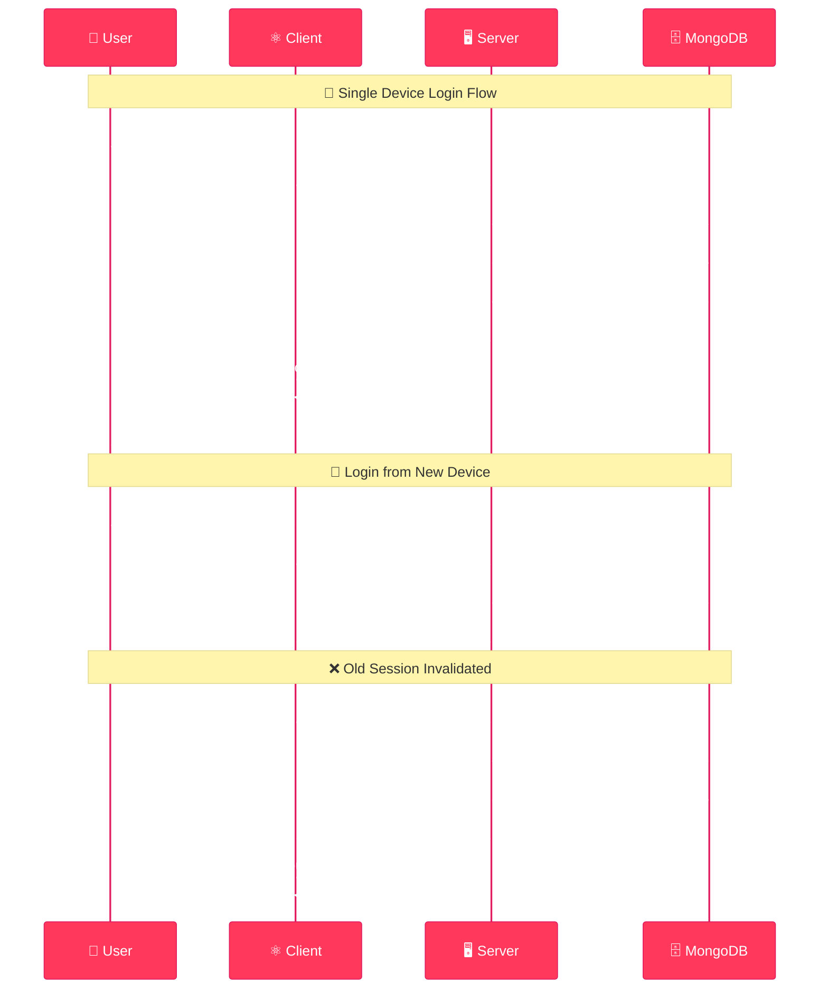
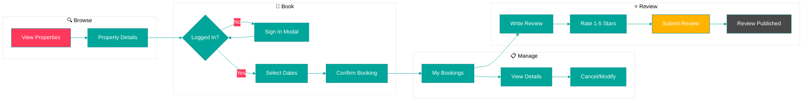
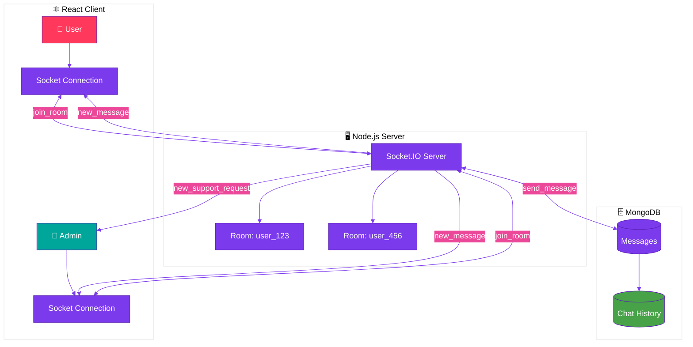
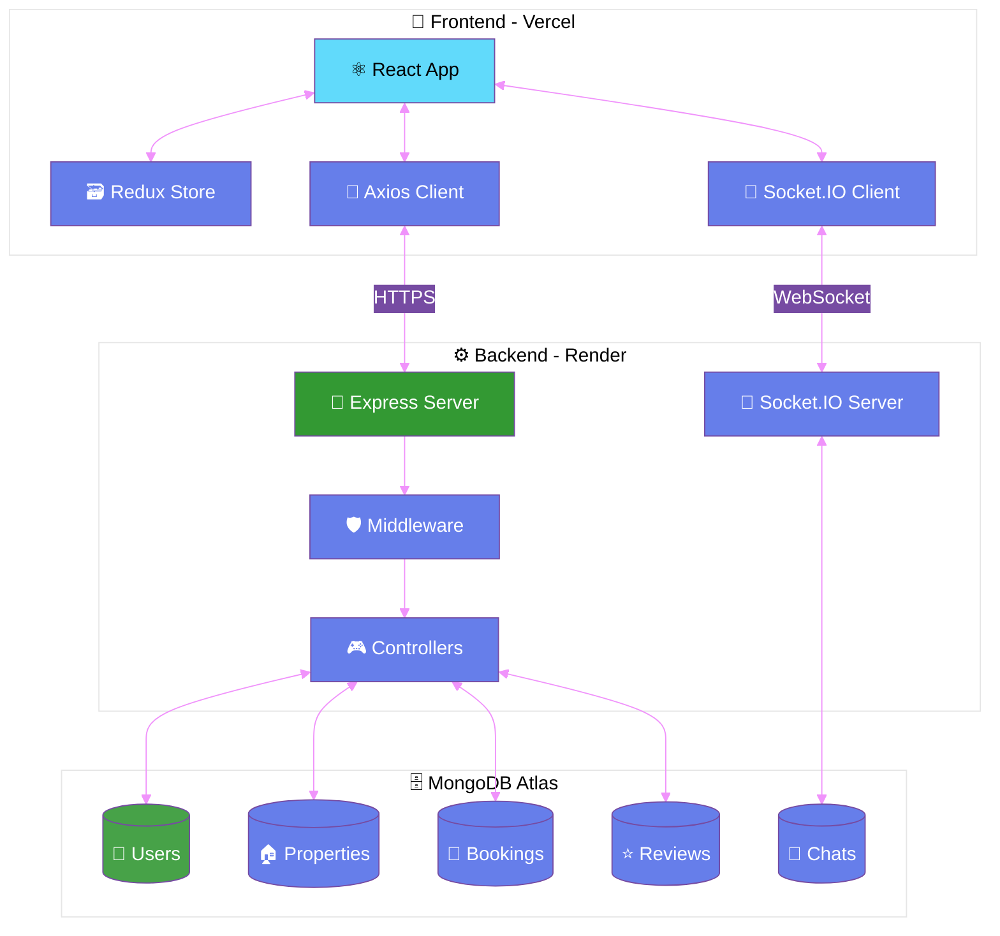
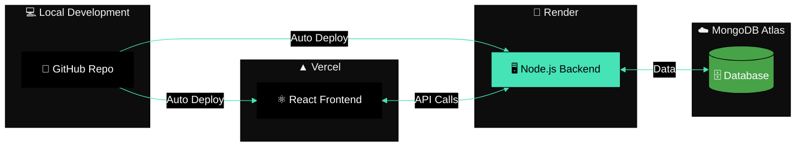

<div align="center">

<!-- Animated Header -->


<!-- Typing Animation -->
<a href="https://git.io/typing-svg"></a>

<!-- Animated Badges -->
<p align="center">
  
  
  
  
  
</p>

<!-- Live Demo -->
<p align="center">
  <a href="https://your-vercel-app.vercel.app"></a>
  <a href="https://your-render-app.onrender.com"></a>
</p>

<!-- Animated Divider -->


### 🌟 A modern full-stack travel booking platform
*Explore properties • Book stays • Write reviews • Real-time support*

<p align="center">
  <a href="#-key-features">Features</a> •
  <a href="#-live-demo">Demo</a> •
  <a href="#-tech-stack">Tech Stack</a> •
  <a href="#-architecture">Architecture</a> •
  <a href="#-getting-started">Getting Started</a>
</p>

</div>

---

## ✨ Key Features

<div align="center">

<!-- Feature Cards with SVG Icons -->
<table>
<tr>
<td align="center" width="25%">

<h3>🏠 Property Experience</h3>
<p align="left">
• 🏡 Browse stunning properties<br>
• 📍 Global destinations<br>
• 🔍 Detailed property views<br>
• 📅 Easy date booking<br>
• ⭐ Rate & review system<br>
• ❤️ Save to favorites<br>
• 🖼️ HD image galleries
</p>
</td>
<td align="center" width="25%">

<h3>🔐 Secure Authentication</h3>
<p align="left">
• 🎨 Beautiful auth UI<br>
• 📱 Single device login<br>
• 🎫 JWT authentication<br>
• 🔒 Session management<br>
• 🌙 Dark mode support<br>
• 👤 User profiles<br>
• 🛡️ Bcrypt encryption
</p>
</td>
<td align="center" width="25%">

<h3>💬 Real-Time Chat</h3>
<p align="left">
• 🔴 Live support chat<br>
• ⚡ Socket.IO powered<br>
• 👮 Admin dashboard<br>
• 📝 Message history<br>
• ✅ Read receipts<br>
• 🔔 Instant notifications<br>
• 🎯 Multi-room support
</p>
</td>
<td align="center" width="25%">

<h3>⚙️ Admin Panel</h3>
<p align="left">
• 📊 Dashboard stats<br>
• 🏨 Manage properties<br>
• 👥 User management<br>
• 💬 Support tickets<br>
• ➕ Add properties<br>
• ✏️ Edit/Delete CRUD<br>
• 📈 Analytics view
</p>
</td>
</tr>
</table>

</div>

<!-- Animated Divider -->


## 🔄 User Authentication Flow

<div align="center">



</div>

<!-- Animated Divider -->


## 📅 Booking & Review System

<div align="center">



</div>

<!-- Animated Divider -->


## 💬 Real-Time Chat Architecture

<div align="center">



</div>

<!-- Animated Divider -->


## 🏗️ System Architecture

<div align="center">



</div>

<!-- Animated Divider -->


## 🧰 Tech Stack

<div align="center">

### 💻 Frontend Technologies

<p>
  
</p>

| Technology | Purpose | Version |
|------------|---------|---------|
|  | UI Library | 18.x |
|  | State Management | Latest |
|  | Component Library | v5 |
|  | CSS-in-JS | Latest |
|  | Real-time Chat | v4 |
|  | Routing | v6 |

### ⚙️ Backend Technologies

<p>
  
</p>

| Technology | Purpose | Version |
|------------|---------|---------|
|  | Runtime | Latest |
|  | Framework | Latest |
|  | Real-time | v4 |
|  | Database | Atlas |
|  | Authentication | Latest |
|  | Password Hash | Latest |

</div>

<!-- Animated Divider -->


## 📱 Pages & Routes

<div align="center">

| 🎯 Page | 🛤️ Route | 📝 Description |
|---------|---------|----------------|
|  | `/` | Landing page with hero, search & featured properties |
|  | `/properties` | Browse all available properties with filters |
|  | `/properties/:id` | Full-screen hero image, booking & reviews |
|  | `/bookings` | User's booking history & management |
|  | `/favourite` | Saved properties collection |
|  | `/concierge` | Real-time support chat |
|  | `/admin` | Admin dashboard & management |
|  | `/blogs` | Travel tips & articles |
|  | `/contact` | Contact form |

</div>

<!-- Animated Divider -->


## 🚀 Getting Started

<div align="center">

<table>
<tr>
<td width="50%">

### 1️⃣ Clone & Install

```bash
# Clone the repository
git clone https://github.com/krishbhuva03/airbnb.git
cd airbnb

# Install client dependencies
cd client && npm install

# Install server dependencies
cd ../server && npm install
```

</td>
<td width="50%">

### 2️⃣ Configure Environment

**Server `.env`:**
```env
MONGODB_URL=your_mongodb_atlas_url
JWT=your_jwt_secret_key
PORT=8080
CORS_ORIGINS=http://localhost:3000
```

**Client `.env`:**
```env
REACT_APP_BASE_URL=http://localhost:8080/api/
```

</td>
</tr>
</table>

</div>

### 🎯 Run Development Servers

<div align="center">

| Server | Command | Port |
|--------|---------|------|
| 🎨 **Frontend** | `cd client && npm start` | [localhost:3000](http://localhost:3000) |
| ⚙️ **Backend** | `cd server && npm start` | [localhost:8080](http://localhost:8080) |

</div>

<!-- Animated Divider -->


## 🌐 Deployment

<div align="center">



### Environment Variables for Production

| Platform | Variable | Value |
|----------|----------|-------|
| **Render** | `CORS_ORIGINS` | `https://your-app.vercel.app` |
| **Render** | `MONGODB_URL` | Your MongoDB Atlas connection string |
| **Render** | `JWT` | Your secret key |
| **Vercel** | `REACT_APP_BASE_URL` | `https://your-api.onrender.com/api/` |

</div>

<!-- Animated Divider -->


## 🛡️ Security Features

<div align="center">

<table>
<tr>
<td align="center" width="33%">

<h3>🔒 Authentication</h3>
<p align="left">
✅ JWT token authentication<br>
✅ Single device login<br>
✅ Bcrypt password hashing<br>
✅ Session invalidation<br>
✅ Protected routes<br>
✅ Auto logout on expiry
</p>
</td>
<td align="center" width="33%">

<h3>⚡ API Security</h3>
<p align="left">
✅ CORS protection<br>
✅ Rate limiting ready<br>
✅ Input validation<br>
✅ Error handling<br>
✅ Environment variables<br>
✅ Middleware guards
</p>
</td>
<td align="center" width="33%">

<h3>✨ Data Integrity</h3>
<p align="left">
✅ MongoDB ObjectId validation<br>
✅ Duplicate review prevention<br>
✅ User-specific data access<br>
✅ Admin role verification<br>
✅ Booking date validation<br>
✅ Mongoose schema validation
</p>
</td>
</tr>
</table>

</div>

<!-- Animated Divider -->


## 🤝 Contributing

<div align="center">


### We Love Contributions! 💖

```bash
# Fork the repo and clone
git clone https://github.com/yourusername/airbnb.git

# Create a new branch
git checkout -b feature/amazing-feature

# Make your changes and commit
git commit -m "✨ Add amazing feature"

# Push to your fork
git push origin feature/amazing-feature

# Open a Pull Request 🎉
```

<p>
  
  
  
</p>

</div>

<!-- Animated Divider -->


## 👨‍💻 Author

<div align="center">

<a href="https://github.com/krishbhuva03">
  
</a>

</div>

<!-- Animated Footer -->


</div>